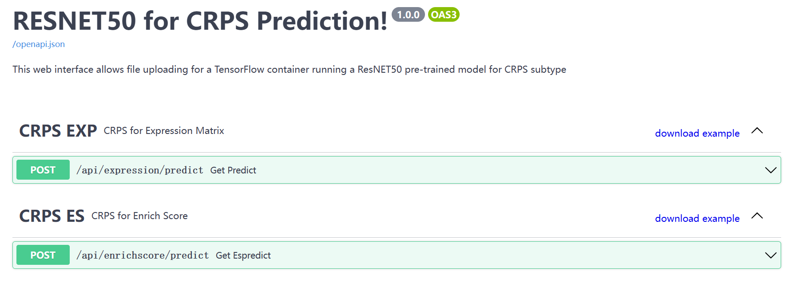

# U-CAN CRPS Model


U-CAN CRPS Model is written in the Python3 programming language. We used ResNet50 and Tensorflow-2.3 to train a classifier based on U-CAN's colorectal pathway profile. This repo can be used for CRPS (Colorectal Cancer Prognostic Subtypes) category prediction.


---

# _Documentation_

- [Background](#Background)
- [Installation](#installation)
  - [Download zip](#Download-zip)
  - [Clone repository](#Clone-repository)
-[Setting Enviroment](#Setting-Enviroment)
- [Run](#run)
- [Viewing the results](#viewing-the-results)
- [License](#License)
- [Contact](#Contact)

---

## Background
After using Seurat to identify 5 stable Colorectal Prognostic Subgroups (CRPS) from all Uppsala-Umeå Comprehensive Cancer Consortium (U-CAN) CRC samples, we built a classifier based on the deep residual learning framework to validate the CRPS de novo classifications.
This model runs with ssGSEA data generated in a matrix format and allows classification into 5 CRPSs as well as normal samples. Samples with class probabilities less than 0.5 will be categorized as NA. Potential users are suggested to first run with“Example data" to learn the running environment.

---

## Installation

### Download zip
```bash
wget https://github.com/SkymayBlue/U-CAN_CRPS_Model/archive/master.zip
unzip U-CAN_CRPS_Model-master.zip
```
or
### Clone repository
```bash
git clone https://github.com/SkymayBlue/U-CAN_CRPS_Model.git
```

---

## Setting Environment
A typical user can install the libraries using the following command:
``` bash
python3 -m pip install -r requirements.txt
```
If you want to run with expression matrix, you also need to install rpy2 and the R packages mentioned in`requestment_r.txt`

---

# Run
Run server.py will open the browser with the url http://127.0.0.1:8080/docs, you will see the web.You may choose to input expresson matrix or enrichment score matrix calculated with "GSVA" by yourself, then you can upload and perform CRPS prediction on the csv file, which is in test data directory, and click "Execute" to test whether your installation is corrected or not.
```bash
python3 server.py
```
If you succeed, you will see a response like this.
You can download example file by clicking "download example" to check the data format, and prepare your local data to run this model. But please note that maximun size for input data is 200M and this will take the program a long time to response.
For the input data larger than 200M, the best way is to run gsva and get enrichment score first:
``` bash
Rscript ./src/run_gsva.R -i expression_matrix.csv.gz

```
The Input matrix of this R script should be TPM or logTPM of mRNAs. If the input format is not compressed csv, please feel free to change this R script.

---

# Viewing the results
The "predictions_only.xlsx" in "predict" dir have eight columns: samples, the probability and the most likely class.

---
# License
Distributed under the GPL-2.0 License License. See `LICENSE` for more information.

---
# Contact
Meizhen Wu - wumeizhen@genomics.cn.
if any bugs, create an issue!
