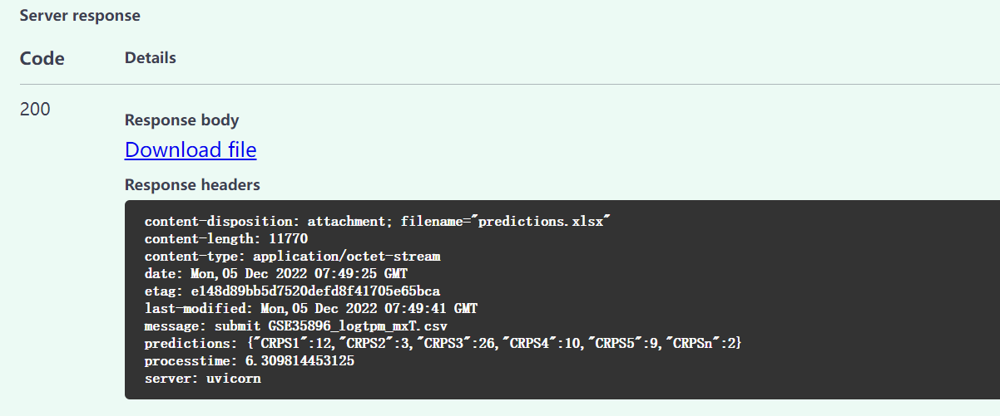
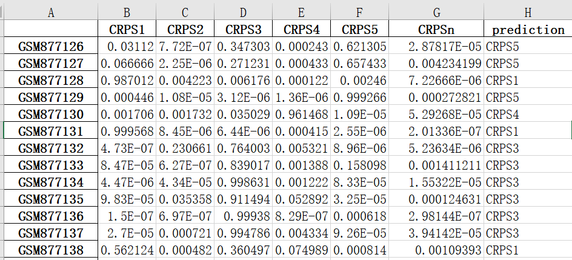

# U-CAN CRPS Model


U-CAN CRPS Model is written in the Python3 programming language. We used ResNet50 and Tensorflow-2.3 to train a classifier based on U-CAN's colorectal pathway profile. This repo can be used for CRPS (Colorectal Prognostic Subgroups) category prediction.


---

# _Documentation_

- [Background](#Background)
- [Installation](#installation)
  - [Download zip](#Download-zip)
  - [Clone repository](#Clone-repository)
-[Setting Enviroment](#Setting-Enviroment)
- [Run](#run)
- [Viewing the results](#viewing-the-results)

---

## Background
After using Seurat to identify stable clusters of all CRC samples, these samples are from the Uppsala-Umeå Comprehensive Cancer Consortium (U-CAN) biobank collections (Uppsala Biobank and Biobanken Norr).To validate the CRPS de novo classification, we built a classifier based on the deep residual learning framework.

---

## Installation

### Download zip
```bash
wget https://github.com/SkymayBlue/U-CAN_CRPS_Model/archive/master.zip
unzip U-CAN_CRPS_Model-master.zip
```
or
### Clone repository
```bash
git clone https://github.com/SkymayBlue/U-CAN_CRPS_Model.git
```

---

## Setting Environment
A typical user can install the libraries using the following command:
``` bash
python3 -m pip install -r requirements.txt
```

---

# Run
Run main.py will open the browser with the url http://127.0.0.1:8080/, you need to click the button "Try it out" in POST, then you can upload and perform CRPS prediction on the csv file which is in testdata directory, and click "Execute" to test whether your installation is corrected or not. 
```bash
python3 main.py
```
If you are succeed, you will see a response like this.

# Viewing the results
The "predictions_only.xlsx" in "predict" dir have eight columns: samples, the probability and the most likely class.
